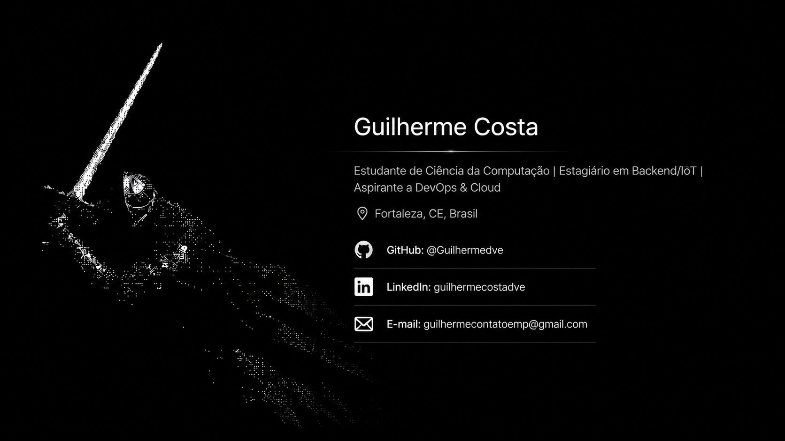

  

<h1 align="center">Olá, eu sou o Guilherme 👋</h1>

  Estudante de Ciência da Computação | Estagiário em Backend/IoT | Rumo a DevOps & Cloud

  
  

---

### ⚡ Sobre mim
- 🎓 Cursando **Ciência da Computação** no Centro Universitário Farias Brito (Fortaleza, CE)
- 💼 Estagiário na **3v3 Tecnologia**, atuando com automação e IoT no agronegócio — passo pelo fluxo completo de dados, de sensores em campo até banco, com Linux, Docker, MariaDB, MQTT e infraestrutura de rede
- 🚀 Construindo e mantendo em produção sistemas de backend e automação para suporte interno (geração de relatórios, monitoramento de frota de dispositivos)
- 🌱 Estudando **DevOps, Cloud (AWS) e Kubernetes** — buscando a transição para uma vaga júnior em Cloud/DevOps
- 📜 Preparando a certificação **GitHub Foundations (GH-900)**

---

### 🛠️ Tecnologias

**Backend & Linguagens**

**Frontend**

**Infra, Automação & Dados**

---

### 📂 Projetos em destaque

| Projeto | Descrição | Stack |
|---|---|---|
| 📊 **API de Cálculo (dados)** | Consulta dados de produção via túnel SSH, processa e cacheia os resultados em Redis, expondo apenas o JSON consumido pela API de PDF | NestJS, TypeORM, MariaDB, Redis, Docker |
| 📜 **API de Renderização de PDF** | Consome o JSON da API de Cálculo, processa em fila e gera relatórios em PDF estilizados via Chromium. Controle de concorrência e deploy automatizado via GitHub Actions + Watchtower | NestJS, BullMQ, Redis, Puppeteer, Docker |
| 📡 **Monitoramento de Frota (Raspberry Pi)** | Automação que monitora remotamente uma frota de dispositivos Linux via SSH, com inventário dinâmico em Google Sheets, relatórios diários por e-mail e alertas automáticos quando CPU/RAM/disco ultrapassam limites | n8n, SSH, Google Sheets API, Google Cloud OAuth2 |
| 🔗 **Encurtador de Links** | Encurtador de URLs com frontend próprio, em processo de deploy em instância EC2 | React, Java, Spring Boot |

---

### 📊 Estatísticas do GitHub

  
  

  

---

### 📫 Contato
- ✉️ **Email:** [guilhermecontatoemp@gmail.com](mailto:guilhermecontatoemp@gmail.com)
- 🐙 **GitHub:** [@Guilhermedve](https://github.com/Guilhermedve)
